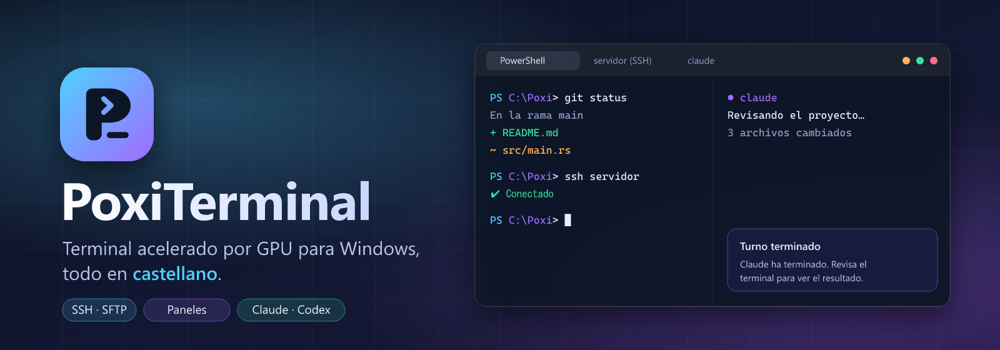

<div align="center">



<br />


**Terminal acelerado por GPU para Windows, todo en castellano.**
Pestañas, paneles, SSH, SFTP y tus sesiones de Claude Code o Codex en una sola ventana.

<sub><a href="#-english">English below</a></sub>

</div>

---

## 🎯 Qué es

PoxiTerminal es un terminal nativo para Windows, escrito en **Rust** y dibujado por la
**GPU** con GPUI, el mismo motor gráfico que usa el editor Zed. No hay navegador
embebido ni Electron: la ventana va fluida aunque tengas diez paneles abiertos.

Está basado en [**pebrel**](https://github.com/Kuddev/pebrel), un terminal excelente
que solo estaba en inglés y en el que se colaban **avisos y notificaciones en chino**.
PoxiTerminal traduce toda la interfaz al castellano: menús, ajustes, errores,
notificaciones, paleta de comandos y hasta el instalador.

> 🇪🇸 Arranca en castellano aunque tu Windows esté en otro idioma. Si prefieres el
> inglés, se cambia en **Configuración → Apariencia → Idioma**.

## 📥 Descarga

Busca la última versión en **[Releases](../../releases/latest)**:

| Archivo | Para qué |
|---|---|
| `PoxiTerminal-v0.1.0-windows-x64-setup.exe` | **Instalador.** Accesos directos, «Abrir en PoxiTerminal» en el menú contextual y actualizaciones automáticas |
| `PoxiTerminal-v0.1.0-windows-x64.zip` | **Portable.** Descomprime y ejecuta `poxiterminal.exe` |

> 🤝 **Convive con pebrel.** Usa su propia carpeta de ajustes (`%APPDATA%\PoxiTerminal`),
> sus propias credenciales y sus propias integraciones de IA. Puedes tener los dos
> instalados sin que se pisen.

## ✨ Qué trae

| | |
|---|---|
| ⚡ **Acelerado por GPU** | Interfaz nativa con GPUI: desplazamiento suave, temas, transparencia y fondos |
| 🗂️ **Pestañas y paneles** | Pestañas en barra lateral o arriba, paneles divididos que se arrastran y cada uno con su carpeta |
| 🔐 **SSH integrado** | Hosts guardados, alias de `~/.ssh/config`, proxys, saltos, claves privadas y verificación del host |
| 📁 **SFTP** | Explora el servidor, sube y baja archivos y carpetas con progreso y cancelación |
| 🤖 **Sesiones de IA** | Claude Code, Codex, opencode, Kimi y más: iconos propios, estado de cada turno y avisos cuando terminan o piden aprobación |
| 💡 **Autocompletado inteligente** | Sugiere ramas de Git, scripts de npm, hosts SSH, distros de WSL y rutas, sin plugins ni IA |
| 🌿 **Panel de Git** | Cambios, stage, commit, push y pull sin salir del terminal |
| 📖 **Lector de documentos** | Markdown y fórmulas matemáticas renderizadas de forma nativa |
| 🎨 **Temas e iconos** | Temas claros y oscuros, fondos con imagen y 25 colores para el icono de la app |
| ☁️ **Copia de seguridad** | Guarda y sincroniza tu configuración en una carpeta, WebDAV, S3 o un servidor SSH, con cifrado |
| 🔄 **Actualizaciones automáticas** | Comprueba este repositorio y se instala sola cuando tú le dices |

## ⌨️ Atajos principales

| Acción | Tecla |
|---|---|
| Paleta de comandos | `Ctrl` + `Shift` + `P` |
| Salto rápido (pestañas, paneles, carpetas, SSH) | `Ctrl` + `Shift` + `O` |
| Elegir shell o perfil | `Ctrl` + `K` |
| Nueva pestaña / cerrar pestaña | `Ctrl` + `Shift` + `T` / `Ctrl` + `Shift` + `W` |
| Pestaña siguiente / anterior | `Ctrl` + `Tab` / `Ctrl` + `Shift` + `Tab` |
| Dividir a la derecha / abajo | `Ctrl` + `Shift` + `D` / `Ctrl` + `Shift` + `S` |
| Panel de archivos / panel de Git | `Ctrl` + `Shift` + `F` / `Ctrl` + `Shift` + `G` |
| Nueva ventana | `Ctrl` + `Shift` + `E` |
| Terminal rápido (desde cualquier sitio) | `Ctrl` + `` ` `` |
| Pantalla completa | `Alt` + `Enter` |

Todos se pueden cambiar en **Configuración → Atajos de teclado**.

## 🔮 Trucos escondidos

| | |
|---|---|
| 🔍 **Busca en español** | La paleta de comandos y la configuración entienden «nueva pestaña», «fuente», «transparencia», «copia de seguridad»… |
| 🖱️ **Clic derecho en una carpeta** | En el Explorador de Windows: *Abrir en PoxiTerminal* (también en WSL) |
| 🔔 **Las notificaciones te llevan al panel** | Pulsa el aviso de «Turno terminado» y saltas al terminal donde está esa IA |
| 📋 **Pega imágenes** | Una captura en el portapapeles se guarda como PNG y se pega su ruta en el terminal (local, WSL o SSH) |
| 💾 **Guarda tu distribución** | Paleta → *Exportar espacio de trabajo* guarda pestañas y paneles para abrirlos otro día |
| 🧩 **Configuración en Lua** | *Abrir archivo de configuración* desde la paleta; se recarga en caliente y, si te equivocas, conserva la última válida |

## 🔧 Compilar

Requiere [Rust](https://rustup.rs), Visual Studio Build Tools (C++) e
[Inno Setup 6](https://jrsoftware.org/isinfo.php) para el instalador.

```bat
start.bat     :: compila y abre PoxiTerminal en modo desarrollo
build.bat     :: genera el ZIP portable y el instalador en dist\
```

Pruebas: `cargo test -p nebula --bin poxiterminal --features gpui-shell`

### 🗃️ Estructura

```
nebula_app/           la aplicación: ventana, pestañas, ajustes, SSH, IA…
  i18n/es-ES.json     catálogo de textos en castellano
  i18n/es-ES.phrases.json   traducciones de los textos sueltos del código
nebula_terminal/      núcleo del terminal: PTY, VT, rejilla
nebula_hook/          puente entre las CLI de IA y el terminal
nebula_settings/      ajustes persistentes e idiomas
scripts/              empaquetado, instalador y auditorías de traducción
```

### 🌍 Traducciones

Si ves algún texto en inglés o en chino, es un bug. Estas dos auditorías lo encuentran:

```bat
python scripts\i18n_missing.py es-ES    :: claves del catálogo sin traducir
python scripts\i18n_audit.py cjk        :: textos en chino que quedan en el código
```

## ❤️ Créditos y licencia

PoxiTerminal es un trabajo derivado de **[pebrel](https://github.com/Kuddev/pebrel)**
(© Kuddev) y se distribuye bajo la misma licencia, **[GPL-3.0](LICENSE)**. Todo el
mérito del motor es suyo; aquí se ha traducido, adaptado y seguirá mejorando.
Las licencias de terceros están en [`THIRD-PARTY-NOTICES`](THIRD-PARTY-NOTICES) y
[`licenses/`](licenses/).

---

## 🇬🇧 English

**PoxiTerminal** is a GPU-accelerated Windows terminal built with Rust and GPUI. It is a
fork of [pebrel](https://github.com/Kuddev/pebrel) with the whole interface translated to
Spanish (English remains available in the settings).

- ⚡ Native GPU rendering, tabs, split panes, themes and backgrounds.
- 🔐 Built-in SSH and SFTP with saved hosts, proxies and jump hosts.
- 🤖 Claude Code, Codex and other AI CLIs with per-turn status and notifications.
- 🔄 Automatic updates from this repository's releases.
- 🤝 Runs side by side with pebrel: separate settings, credentials and AI hooks.

Download the installer or the portable ZIP from **[Releases](../../releases/latest)**.
Build with `build.bat` (Rust, VS Build Tools and Inno Setup 6 required).

Licensed under **[GPL-3.0](LICENSE)**, as a derivative work of pebrel by Kuddev.
